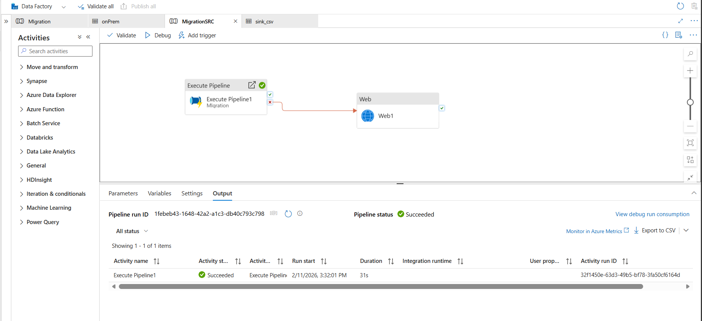
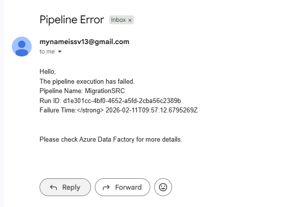

# SQL to Data Lake ETL using Logic Apps

## Overview
This project moves data from **on-prem SQL Server** to **Azure Data Lake** using **Azure Logic Apps**.  
It also sends **Gmail notifications** if the workflow fails.

---

## Workflow
- **Logic App** is triggered via an **HTTP request**.  
- If any step fails, a **Gmail email** is sent with pipeline details.

---

## Gmail Email Template

Hello,

The pipeline execution has failed.

Pipeline Name: @{triggerBody()?['pipeline_name']}
Run ID: @{triggerBody()?['pipeline_id']}
Failure Time: @{utcNow()}

Please check Azure Data Factory for more details.

---

## Notes
- Configure the Gmail action to **run after failure**.  
- Replace `pipeline_name` and `pipeline_id` with your actual dynamic content from the HTTP trigger.  
- This setup works for **scheduled or manual triggers** from ADF or other services.
